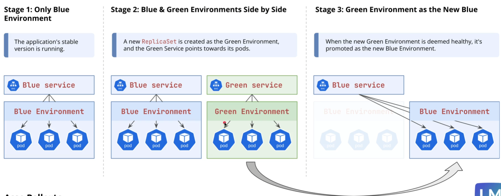
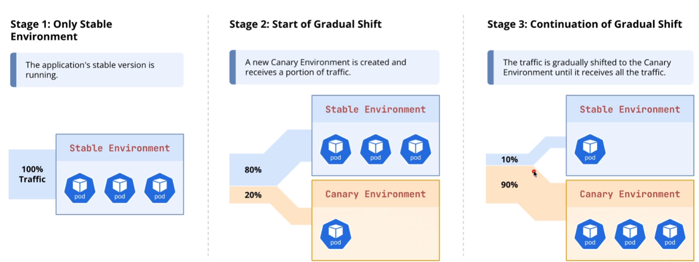
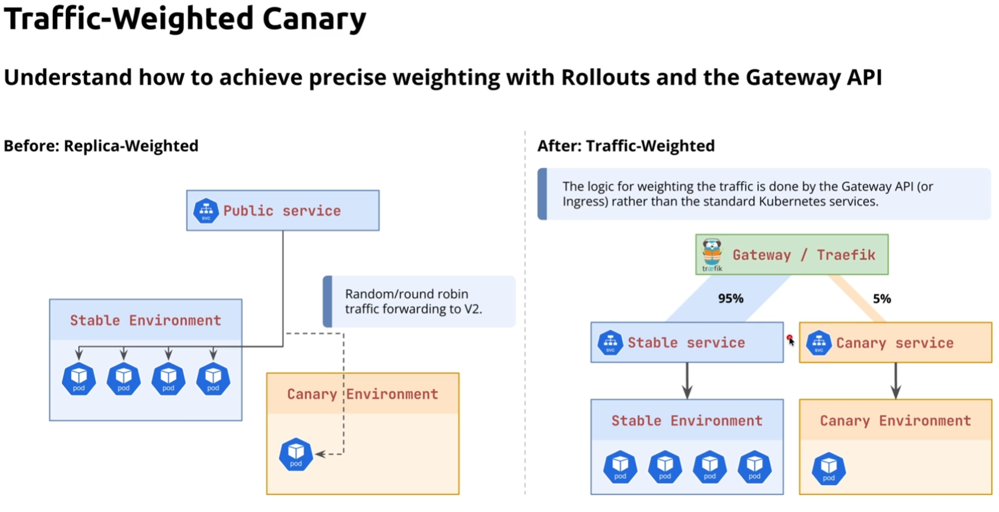
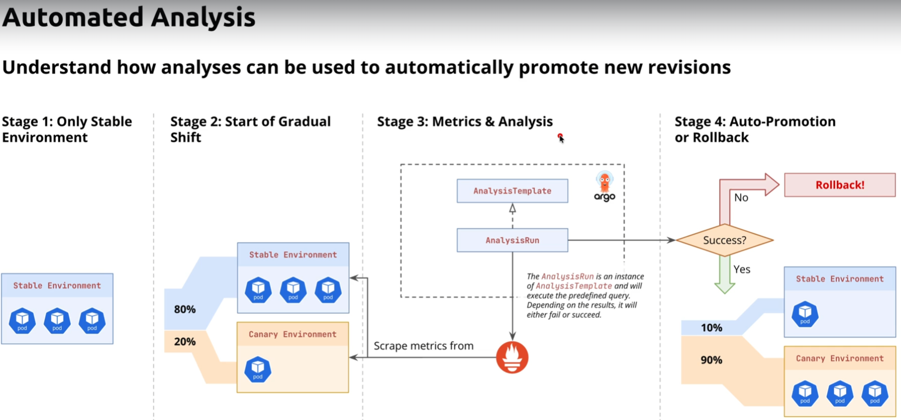

- [Installing Argo Rollouts](#installing-argo-rollouts)
  - [🎯 Lab Goal](#-lab-goal)
  - [📝 Overview \& Concepts](#-overview--concepts)
  - [📋 Lab Tasks](#-lab-tasks)
    - [Part 1: Clean Up Previous Labs](#part-1-clean-up-previous-labs)
    - [Part 2: Install Argo Rollouts](#part-2-install-argo-rollouts)
    - [Part 3: Install Kubectl Plugin](#part-3-install-kubectl-plugin)
  - [📚 Helpful Resources](#-helpful-resources)
- [First Rollout](#first-rollout)
  - [🎯 Lab Goal](#-lab-goal-1)
  - [📝 Overview \& Concepts](#-overview--concepts-1)
  - [📋 Lab Tasks](#-lab-tasks-1)
    - [Part 1: Deploy the First Version](#part-1-deploy-the-first-version)
    - [Part 2: Execute Rollout](#part-2-execute-rollout)
  - [📚 Helpful Resources](#-helpful-resources-1)
- [Core Rollouts Strategies - Blue Green Deployments](#core-rollouts-strategies---blue-green-deployments)
  - [🎯 Lab Goal](#-lab-goal-2)
  - [📝 Overview \& Concepts](#-overview--concepts-2)
  - [📋 Lab Tasks](#-lab-tasks-2)
    - [Part 1: Deploy Version 1 (Blue)](#part-1-deploy-version-1-blue)
    - [Part 2: Trigger Blue-Green Update](#part-2-trigger-blue-green-update)
    - [Part 3: Verify and Promote](#part-3-verify-and-promote)
  - [📚 Helpful Resources](#-helpful-resources-2)
- [Core Rollouts Strategies - Canary Deployments](#core-rollouts-strategies---canary-deployments)
  - [🎯 Lab Goal](#-lab-goal-3)
  - [📝 Overview \& Concepts](#-overview--concepts-3)
    - [Architecture Diagram](#architecture-diagram)
  - [📋 Lab Tasks](#-lab-tasks-3)
  - [📚 Helpful Resources](#-helpful-resources-3)
- [Setting up Traefik with Kubernetes Gateway API on Kind](#setting-up-traefik-with-kubernetes-gateway-api-on-kind)
  - [Prerequisites](#prerequisites)
  - [Step 1: Start Kind](#step-1-start-kind)
  - [Step 2: Install Gateway API CRDs](#step-2-install-gateway-api-crds)
  - [Step 3: Prepare Traefik Configuration](#step-3-prepare-traefik-configuration)
    - [3.1 Add Helm Repository](#31-add-helm-repository)
    - [3.2 Create Namespace](#32-create-namespace)
    - [3.3 Create `values.yaml`](#33-create-valuesyaml)
  - [Step 4: Install Traefik](#step-4-install-traefik)
  - [Step 5: Deploy Demo Application](#step-5-deploy-demo-application)
    - [5.1 Deploy `whoami` App](#51-deploy-whoami-app)
    - [5.2 Create HTTPRoute](#52-create-httproute)
  - [Step 6: Access the Application](#step-6-access-the-application)
  - [Step 7: Install Argo Rollouts Gateway API Plugin](#step-7-install-argo-rollouts-gateway-api-plugin)
    - [7.1 Configure the Plugin](#71-configure-the-plugin)
    - [7.2 Restart Argo Rollouts](#72-restart-argo-rollouts)
  - [Useful Resources](#useful-resources)
- [Traffic weighting](#traffic-weighting)
  - [🎯 Lab Goal](#-lab-goal-4)
  - [📝 Overview \& Concepts](#-overview--concepts-4)
    - [Architecture Diagram](#architecture-diagram-1)
  - [📋 Lab Tasks](#-lab-tasks-4)
  - [📚 Helpful Resources](#-helpful-resources-4)
- [Header Based Routing](#header-based-routing)
  - [🎯 Lab Goal](#-lab-goal-5)
  - [📝 Overview \& Concepts](#-overview--concepts-5)
  - [📋 Lab Tasks](#-lab-tasks-5)
  - [📚 Helpful Resources](#-helpful-resources-5)
- [Automated Analysis - Canary Deployment](#automated-analysis---canary-deployment)
  - [🎯 Lab Goal](#-lab-goal-6)
  - [📝 Overview \& Concepts](#-overview--concepts-6)
  - [📋 Lab Tasks](#-lab-tasks-6)
  - [📚 Helpful Resources](#-helpful-resources-6)
- [Automated Analysis - Blue-Green Deployment](#automated-analysis---blue-green-deployment)
  - [🎯 Lab Goal](#-lab-goal-7)
  - [📝 Overview \& Concepts](#-overview--concepts-7)
  - [📋 Lab Tasks](#-lab-tasks-7)
  - [📚 Helpful Resources](#-helpful-resources-7)

# Installing Argo Rollouts
## 🎯 Lab Goal

Install the Argo Rollouts controller into your Kubernetes cluster and add the essential `kubectl-argo-rollouts` plugin to your local machine.

## 📝 Overview & Concepts

Before we can perform advanced deployments, we need to install the Argo Rollouts controller. This controller is the brains of the operation; it introduces the `Rollout` Custom Resource Definition (CRD) to our cluster and manages the entire progressive delivery lifecycle. We will use the official Helm chart for a clean and repeatable installation.

We will also install the `kubectl-argo-rollouts` plugin. This is a powerful command-line tool that extends `kubectl` with new commands for visualizing, managing, and interacting with `Rollout` resources, including a rich, real-time dashboard that we'll use extensively.

## 📋 Lab Tasks

### Part 1: Clean Up Previous Labs

If you are coming directly from the Argo CD module, let's clean up the cluster. You can start with a new, fresh cluster or delete the resources you created during the course:

1.  Delete the `guestbook` application from Argo CD to ensure a clean slate.
    ```bash
    argocd app delete guestbook --cascade
    ```
2.  (Optional) If you created the `team-finance` project, you can leave it or delete it. It won't interfere.

### Part 2: Install Argo Rollouts

1.  Ensure the Argo Project Helm repository is added to your local Helm client.
2.  Create a dedicated `argo-rollouts` namespace.
3.  Install the `argo-rollouts` Helm chart into the new namespace.
    - Use the chart name `argo/argo-rollouts`.
    - Set the release name to `argo-rollouts`.
    - Set the Chart version to `2.40.5`.
4.  Verify that the Argo Rollouts controller pod is running correctly in the `argo-rollouts` namespace.

```shell
helm search repo argo-rollouts

helm upgrade argo-rollouts argo/argo-rollouts --version 2.40.5 --install --namespace argo-rollouts --create-namespace --set dashboard.enabled=true

kubectl port-forward service/argo-rollouts-dashboard 31000:3100 -n argo-rollouts

```

### Part 3: Install Kubectl Plugin

1.  Install the `kubectl-argo-rollouts` plugin on your local machine.
2.  Verify that the plugin is installed correctly by running the `version` command.

```shell
curl -LO https://github.com/argoproj/argo-rollouts/releases/latest/download/kubectl-argo-rollouts-darwin-amd64

chmod +x ./kubectl-argo-rollouts-darwin-amd64

sudo mv ./kubectl-argo-rollouts-darwin-amd64 /usr/local/bin/kubectl-argo-rollouts

kubectl argo rollouts version
```

## 📚 Helpful Resources

- [Argo Rollouts - Installation Guide](https://argo-rollouts.readthedocs.io/en/stable/installation/)
- [Argo Rollouts - Kubectl Plugin Installation](https://argo-rollouts.readthedocs.io/en/stable/installation/#kubectl-plugin-installation)
- [Helm `install` Command Documentation](https://helm.sh/docs/helm/helm_install/)

# First Rollout
## 🎯 Lab Goal

Convert a standard Kubernetes Deployment into an Argo Rollout and execute a controlled rollout with a manual pause.

## 📝 Overview & Concepts

In this lab, we will move away from the "all-at-once" update strategy. We will define a `Rollout` resource that uses a progressive delivery strategy. Specifically, we will configure it to replace 20% of the pods with the new version and then **pause indefinitely**.

This "pause" is critical. In a real-world scenario, this is where you would check your metrics or manual test results. We will trigger an update, observe the rollout stop at the 20% mark, and then manually "promote" the rollout to let it finish. We will use the `kubectl argo rollouts` plugin to visualize this process in real-time.

## 📋 Lab Tasks

### Part 1: Deploy the First Version

1.  Create a file named `rollout.yaml` that defines a `Rollout` resource.
    - **Image:** `zenardi/simple-color-app:1.0.0`
    - **Env Var:** `APP_COLOR=orange`
    - **Replicas:** `5`
    - **Strategy:** `canary`
    - **Steps:** `setWeight: 20`, then `pause: {}` (indefinite pause).
2.  Create a file named `service.yaml` pointing to the rollout.
3.  Apply both manifests to deploy **Version 1**.

### Part 2: Execute Rollout

1.  Modify `rollout.yaml` to update the application:
    - Change `APP_COLOR` env var to `blue`.
2.  Apply the change.
3.  Use the `kubectl argo rollouts get rollout ... --watch` command to observe the deployment pausing at the 20% state (1 new pod, 4 old pods).
4.  Manually promote the rollout using the CLI to allow it to proceed to 100%.

## 📚 Helpful Resources

- [Argo Rollouts - Canary Strategy](https://argo-rollouts.readthedocs.io/en/stable/features/canary/)
- [Argo Rollouts - Kubectl Plugin Usage](https://argo-rollouts.readthedocs.io/en/stable/features/kubectl-plugin/)

# Core Rollouts Strategies - Blue Green Deployments
## 🎯 Lab Goal

Configure and execute a Blue-Green deployment, allowing you to preview a new version of your application on a private service before atomically switching all production traffic to it.

## 📝 Overview & Concepts

In this lab, we will implement the Blue-Green strategy. Unlike the Canary strategy which gradually shifts traffic, Blue-Green creates a full parallel set of pods for the new version.



You will define two Kubernetes Services:

1.  **Active Service:** The public-facing service receiving live traffic.
2.  **Preview Service:** A private service used to test the new version.

You will trigger an update, observing how Argo Rollouts spins up the new version (Green) and points the Preview Service to it. You will then verify the Green version works using `kubectl port-forward` (simulating a QA test) while the Active Service remains untouched. Finally, you will promote the rollout to perform an instant cutover.

## 📋 Lab Tasks

### Part 1: Deploy Version 1 (Blue)

1.  Create a new namespace `bluegreen-lab`.
2.  Create a `services.yaml` file defining two services:
    - `rollout-bluegreen-active`: The main entry point for users.
    - `rollout-bluegreen-preview`: A service for testing the new version.
3.  Create a `rollout.yaml` file defining a Rollout with the `blueGreen` strategy.
    - **Image:** `zenardi/simple-color-app:1.0.0`
    - **Env Var:** `APP_COLOR=blue`
    - **Strategy:** `blueGreen`
    - **Active Service:** `rollout-bluegreen-active`
    - **Preview Service:** `rollout-bluegreen-preview`
    - **AutoPromotionEnabled:** `false` (This forces a manual promotion).
4.  Apply the manifests to deploy **Version 1**.

### Part 2: Trigger Blue-Green Update

1.  Update the `rollout.yaml` to change the application color:
    - **Env Var:** `APP_COLOR=green`
2.  Apply the change.
3.  Use the `kubectl argo rollouts` dashboard or CLI to verify the rollout is paused. You should see a new ReplicaSet (Green) fully scaled up, but the Active Service still points to Blue.

### Part 3: Verify and Promote

1.  **Crucial Step:** Use `kubectl port-forward` to connect to the `preview` service and verify it is serving the new Green version.
    - _Tip: Forward the preview service to a different local port (e.g., 8081)._
2.  Verify the `active` service is still serving Blue.
3.  Promote the rollout to switch the `active` service to Green.
4.  Verify the old Blue replica set scales down after the successful cutover.

## 📚 Helpful Resources

- [Argo Rollouts - BlueGreen Strategy](https://argo-rollouts.readthedocs.io/en/stable/features/bluegreen/)
- [Kubectl Port-Forward](https://kubernetes.io/docs/tasks/access-application-cluster/port-forward-access-application-cluster/)

# Core Rollouts Strategies - Canary Deployments
## 🎯 Lab Goal

Configure an advanced Canary rollout that creates dedicated endpoints for the "Canary" and "Stable" versions, enabling precise verification while simultaneously serving mixed traffic to users.

## 📝 Overview & Concepts

In this advanced lab, we go beyond simple replica weighting. We will configure a Rollout that manages **three** distinct Kubernetes Services:



1.  **`rollout-canary-public`**: The standard service that load balances across ALL pods. At the 20% step, this service provides the 80/20 traffic split based on the number of replicas.
2.  **`rollout-canary-preview`**: A dedicated service that Argo Rollouts will constrain to ONLY target the new "Canary" pods.
3.  **`rollout-canary-stable`**: A dedicated service that Argo Rollouts will constrain to ONLY target the old "Stable" pods.

You will see how Argo Rollouts dynamically modifies the `spec.selector` of the preview and stable services to pin them to specific revisions, allowing you to "smoke test" the new version in isolation before promoting it.

### Architecture Diagram


## 📋 Lab Tasks

1.  Create a `services.yaml` file defining three Services: `rollout-canary-public`, `rollout-canary-preview`, and `rollout-canary-stable`. All should initially point to `app: rollout-canary`.
2.  Create a `rollout.yaml` with 10 replicas.
3.  Configure the `strategy.canary` block to include:
    - `canaryService: rollout-canary-preview`
    - `stableService: rollout-canary-stable`
    - Steps: `setWeight: 20`, `pause: {}`, `setWeight: 50`, `pause: {duration: 10s}`.
4.  Deploy Version 1. Verify all three services work.
5.  Update to Version 2.
6.  **The Critical Verification:** When the rollout pauses at 20%:
    - Use `kubectl get endpoints` to see that `preview` points to 2 IPs, `stable` points to 8 IPs, and `public` points to 10 IPs.
    - Use `kubectl port-forward` to hit the `preview` service and confirm it **always** returns Version 2.
    - Use `kubectl port-forward` to hit the `public` service and confirm it returns a mix.
7.  Promote the rollout and watch the transition.

## 📚 Helpful Resources

- [Argo Rollouts - Canary Strategy](https://argo-rollouts.readthedocs.io/en/stable/features/canary/)

# Setting up Traefik with Kubernetes Gateway API on Kind

This guide provides a step-by-step walkthrough for installing and configuring Traefik Proxy as a Kubernetes Gateway provider on Kind, and setting up the Argo Rollouts Gateway API plugin.

**Note:** This setup uses HTTP only (no TLS) for simplicity.

## Prerequisites

- **KIND**: A local Kubernetes cluster.
- **Kubectl**: Kubernetes command-line tool.
- **Helm**: Package manager for Kubernetes.

## Step 1: Start Kind

Start your Kind cluster.

```bash
kind create cluster --config kind.yaml
```

## Step 2: Install Gateway API CRDs

Traefik will be configured to use the Kubernetes Gateway API. The Custom Resource Definitions (CRDs) for Gateway API are not installed by default.

```bash
kubectl apply -f https://github.com/kubernetes-sigs/gateway-api/releases/download/v1.4.0/standard-install.yaml
```

## Step 3: Prepare Traefik Configuration

### 3.1 Add Helm Repository

Add the official Traefik Helm chart repository:

```bash
helm repo add traefik https://traefik.github.io/charts
helm repo update
```

### 3.2 Create Namespace

Create a dedicated namespace for Traefik:

```bash
kubectl create namespace traefik
```

### 3.3 Create `values.yaml`

Create a `values.yaml` file to configure Traefik. This configuration enables the Gateway API provider on HTTP port 80.

```yaml
# values.yaml
ports:
  web:
    port: 80
    nodePort: 30000
    # No redirection to HTTPS

api:
  dashboard: true
  insecure: true

ingressRoute:
  dashboard:
    enabled: true
    matchRule: Host(`dashboard.localhost`)
    entryPoints:
      - web

ingressClass:
  enabled: false

providers:
  kubernetesIngress:
    enabled: false
  kubernetesGateway:
    enabled: true

gateway:
  listeners:
    web:
      port: 80
      protocol: HTTP
      namespacePolicy:
        from: All

logs:
  access:
    enabled: true

metrics:
  prometheus:
    enabled: true
```

## Step 4: Install Traefik

Install Traefik using Helm and the custom values file:

```bash
helm upgrade traefik traefik/traefik \
  --version 37.4.0 \
  --namespace traefik \
  --create-namespace \
  --install \
  --values values/values-traefik.yaml
```

## Step 5: Deploy Demo Application

### 5.1 Deploy `whoami` App

Create a `whoami.yaml` file:

```yaml
apiVersion: apps/v1
kind: Deployment
metadata:
  name: whoami
  namespace: traefik
spec:
  replicas: 2
  selector:
    matchLabels:
      app: whoami
  template:
    metadata:
      labels:
        app: whoami
    spec:
      containers:
        - name: whoami
          image: traefik/whoami
          ports:
            - containerPort: 80
---
apiVersion: v1
kind: Service
metadata:
  name: whoami
  namespace: traefik
spec:
  selector:
    app: whoami
  ports:
    - port: 80
```

Apply it:

```bash
kubectl apply -f whoami.yaml
```

### 5.2 Create HTTPRoute

Create a `whoami-route.yaml` to route traffic via the Gateway:

```yaml
apiVersion: gateway.networking.k8s.io/v1
kind: HTTPRoute
metadata:
  name: whoami
  namespace: traefik
spec:
  parentRefs:
    - name: traefik-gateway
  hostnames:
    - 'whoami.localhost'
  rules:
    - matches:
        - path:
            type: PathPrefix
            value: /
      backendRefs:
        - name: whoami
          port: 80
```

Apply it:

```bash
kubectl apply -f whoami-route.yaml
```

## Step 6: Access the Application

```bash
kubectl port-forward svc/traefik 8000:80 -n traefik
```

1.  **Whoami App**: [http://whoami.localhost:8000](http://whoami.localhost:8000)
2.  **Traefik Dashboard**: [http://dashboard.localhost:8000](http://dashboard.localhost:8000)

## Step 7: Install Argo Rollouts Gateway API Plugin

To use Argo Rollouts with the Gateway API, you need to install the traffic router plugin.

### 7.1 Configure the Plugin

Update the Argo Rollouts values file to configure the Gateway API plugin via `initContainers`

```yaml
# values-rollouts.yaml
dashboard:
  enabled: true

# New: For configuring the Gateway API Plugin
# Source: https://rollouts-plugin-trafficrouter-gatewayapi.readthedocs.io/en/latest/installation/#installing-the-plugin-via-init-containers
controller:
  initContainers:
    - name: copy-gwapi-plugin
      image: ghcr.io/argoproj-labs/rollouts-plugin-trafficrouter-gatewayapi:v0.8.0
      command: ['/bin/sh', '-c']
      args:
        - cp /bin/rollouts-plugin-trafficrouter-gatewayapi /plugins
      volumeMounts:
        - name: gwapi-plugin
          mountPath: /plugins
  trafficRouterPlugins:
    - name: argoproj-labs/gatewayAPI
      location: 'file:///plugins/rollouts-plugin-trafficrouter-gatewayapi'
  volumes:
    - name: gwapi-plugin
      emptyDir: {}
  volumeMounts:
    - name: gwapi-plugin
      mountPath: /plugins
```

Upgrade the helm chart with:

```bash
helm upgrade argo-rollouts argo/argo-rollouts \
  --version 2.40.5 \
  --namespace argo-rollouts \
  --create-namespace \
  --install \
  --values values/values-rollouts.yaml
```

### 7.2 Restart Argo Rollouts

Restart the controller to load the plugin:

```bash
kubectl rollout restart deployment -n argo-rollouts argo-rollouts
```

## Useful Resources

- [Traefik & Kubernetes with Gateway API](https://doc.traefik.io/traefik/reference/install-configuration/providers/kubernetes/kubernetes-gateway/)
- [Traefik Helm Chart](https://artifacthub.io/packages/helm/traefik/traefik)
- [Argo Rollouts Gateway API Plugin Installation Guide](https://rollouts-plugin-trafficrouter-gatewayapi.readthedocs.io/en/latest/installation/#installing-the-plugin-via-init-containers)
- [Traefik Kubernetes Setup](https://doc.traefik.io/traefik/setup/kubernetes/)


# Traffic weighting
## 🎯 Lab Goal

Configure and execute a Traffic-Weighted Canary deployment using the **Kubernetes Gateway API**, achieving precise traffic splitting decoupled from replica counts.

## 📝 Overview & Concepts

In this lab, we will implement the architecture we discussed in the theory lecture. We will create the necessary Gateway API resources (`Gateway` and `HTTPRoute`) to route traffic to our application.

Then, we will define a `Rollout` that uses the `trafficRouting` block to control that `HTTPRoute`. Unlike previous labs, you will see that even with only **1 canary pod**, we can send exactly **5%** of traffic to it.



### Architecture Diagram


## 📋 Lab Tasks

1.  Create a new namespace `gateway-lab`.
2.  Create a `services.yaml` file defining two Services: `rollout-gateway-stable` and `rollout-gateway-canary`. Both should point to `app: rollout-gateway`.
3.  Create a `gateway.yaml` file defining:
    - A `Gateway` resource listening on port 80.
    - An `HTTPRoute` resource pointing to the stable and canary services.
4.  Create a `rollout.yaml` configured with:
    - `trafficRouting` using the `gatewayAPI` provider.
      ```yaml
      strategy:
        canary:
          canaryService: rollout-gateway-canary
          stableService: rollout-gateway-stable
          trafficRouting:
            plugins:
              argoproj-labs/gatewayAPI:
                httpRoute: rollout-gateway-route # our created httproute
                namespace: gateway-lab # namespace where this rollout resides
      ```
    - Steps:
      - Set the weight to 30% and pause indefinitely
      - Set the weight to 40% and pause for 20 seconds
      - Set the weight to 60% and pause for 20 seconds
      - Set the weight to 80% and pause for 20 seconds
5.  Apply the manifests to deploy **Version 1**.
6.  Deploy a **Version 2** by changing the APP_COLOR environment variable.
7.  **Verify Precision:**
    - Observe the Rollout pausing at the 30% step.
    - Use `kubectl get httproute ... -o yaml` to inspect the live route configuration and confirm the weights are exactly `70` and `30`.
8.  Promote the rollout to completion.

## 📚 Helpful Resources

- [Gateway API - HTTPRoute](https://gateway-api.sigs.k8s.io/api-types/httproute/)
- [Argo Rollouts - Traffic Routing](https://argo-rollouts.readthedocs.io/en/stable/features/traffic-management/)

# Header Based Routing
## 🎯 Lab Goal

Implement a Header-Based traffic split by configuring Argo Rollouts to route traffic to the new version based on a specific HTTP header, while keeping public traffic at a minimum.

## 📝 Overview & Concepts

In this lab, you will modify your Canary strategy to include a **header-based routing step**.

You will configure the rollout to look for the header `x-canary: true`. You will also use the `setCanaryScale` step to ensure there are actually pods running to handle this special traffic, even when the public traffic weight is set to a low value. You will verify this behavior using the `test-requests.sh` script available (use `--public` to simulate public access, and `--tester` to simulate adding the `x-canary` header).

## 📋 Lab Tasks

1.  **Reset** your `gateway-lab` environment to a clean state (deploy Version 1).
2.  **Modify** your `rollout.yaml` strategy to include a new first step:
    - Set a weight of 1% for traffic split.
    - Scale up the Canary ReplicaSet to a weight of `40` (ensure physical pods are running).
    - `setHeaderRoute`: Match header `x-canary` with value `true`.
    - `pause`: Pause indefinitely to allow for testing.
    - Continue with the promotion of traffic as before.
3.  **Apply** the changes and trigger an update to **Version 2**.
4.  **Verify Public Traffic:** Use the `test-requests` script with the `--public` flag to confirm standard users still see Version 1 most of the time.
5.  **Verify Test Traffic:** Use the `test-requests` script with the `--tester` flag (or use `curl -H "x-canary: true"`) to confirm you can access Version 2.
6.  **Promote** the rollout to proceed to the next steps and observe the shift.

## 📚 Helpful Resources

- [Argo Rollouts - Header Based Routing](https://argo-rollouts.readthedocs.io/en/stable/features/traffic-management/#traffic-routing-based-on-a-header-values-for-canary)
- [Argo Rollouts - setCanaryScale](https://argo-rollouts.readthedocs.io/en/stable/features/canary/#setcanaryscale)


# Automated Analysis - Canary Deployment

## 🎯 Lab Goal

Configure a self-healing deployment pipeline that automatically detects a high error rate using Prometheus metrics and aborts the rollout without human intervention.

## 📝 Overview & Concepts

In this lab, you will combine many concepts we've learned so far.

1.  **Define Success:** You will create an `AnalysisTemplate` that queries your local Prometheus instance. It will check if the application's Global Success Rate is above 90%.
2.  **Configure Automation:** You will attach this template to your `Rollout` strategy to run as a step in our canary release.
3.  **Simulate Failure:** You will generate synthetic traffic using a simple script. Then, you will deploy a "Bad" version of the application configured to throw random 500 errors.
4.  **Observe Self-Healing:** You will watch as Argo Rollouts detects the drop in success rate, marks the analysis as `Failed`, and automatically aborts the rollout, scaling the new faulty pods down to zero and restoring 100% traffic to the stable version.

## 📋 Lab Tasks

1.  **Setup:**
    1.  Create the `analysis-lab` namespace.
    2.  Configure the Pod template in the provided `rollout.yaml`, as well as the services within `services.yaml` with the necessary annotations for Prometheus to start scraping metrics. Metrics are exposed on the `/metrics` endpoint and the application is running on port `3000`.
    3.  Deploy the Rollout and the services.
2.  **Start Traffic Generation:** Run the provided `test-requests.sh` script in a separate terminal to generate continuous traffic for the `rollout-analysis` service.
    1.  Observe how metrics soon start showing up in the Prometheus dashboard.
3.  **Define Analysis:** Create an `analysis.yaml` file defining an `AnalysisTemplate` named `success-rate` in the `analysis-lab` namespace. It should query Prometheus to calculate the success rate (non-500 requests / total requests). You can use the following query for that:
    ```
    sum(rate(http_request_duration_seconds_count{code!~"[45].*", service="{{args.service-name}}"}[1m]))
    /
    sum(rate(http_request_duration_seconds_count{service="{{args.service-name}}"}[1m]))
    ```
4.  Update your `rollout.yaml` to include an `analysis` step in the canary strategy.
    - Use the `analysis-lab` namespace.
    - Pause for 3 minutes after the first weight increase. This will allow for metrics to start flowing in.
    - Add an analysis step after this first increase referencing the `success-rate` analysis template.
5.  **Deploy the "Bad" Version:** Update `rollout.yaml` to set the `ERROR_RATE` environment variable to `0.5` (50% errors). Apply this change.
6.  **Watch the Dashboard:** Observe the rollout pause, the `AnalysisRun` start, and then quickly fail as Prometheus reports the errors.
7.  **Verify Rollback:** Confirm the status becomes `Degraded` (which means it aborted) and the Stable pods are taking 100% of the traffic again.

## 📚 Helpful Resources

- [Argo Rollouts - Analysis Configuration](https://argo-rollouts.readthedocs.io/en/stable/features/analysis/)
- [PromQL Basics](https://prometheus.io/docs/prometheus/latest/querying/basics/)

# Automated Analysis - Blue-Green Deployment
## 🎯 Lab Goal

Perform a Blue-Green deployment that automatically validates the new version (Preview) using an `AnalysisRun` _before_ switching production traffic (Active) to it.

## 📝 Overview & Concepts

In a standard Blue-Green deployment, the new version (Green) is deployed alongside the old version (Blue). Usually, a human checks the "Preview" service and then manually promotes the rollout.

With **Pre-Promotion Analysis**, we can automate this. Argo Rollouts will:

1.  Deploy the new version (Green).
2.  Update the `previewService` to point to Green.
3.  **Automatically start an AnalysisRun**.
4.  **Block** the promotion to `activeService` until the analysis passes.
5.  If the analysis succeeds, it automatically switches the `activeService` to Green.
6.  If the analysis fails, it aborts the rollout.

## 📋 Lab Tasks

1.  **Define Services:** Create two services:
    - `blue-green-active`: For production traffic.
    - `blue-green-preview`: For the new version.
    - _Remember to add Prometheus annotations!_
2.  **Define Analysis:** Create an `analysis.yaml` (similar to the previous lab) that checks for a high success rate.
3.  **Define Rollout:** Create a `rollout.yaml` using the `blueGreen` strategy.
    - Configure `activeService` and `previewService`.
    - Add a `prePromotionAnalysis` block that references your analysis template.
    - Pass the **preview service name** as an argument to the analysis.
4.  **Deploy v1:** Apply the manifests and verify the active service points to v1.
5.  **Deploy v2:** Change the color and set an appropriate error rate to deploy a new version.
6.  **Generate Traffic:** **Crucial Step!** The analysis checks metrics on the _preview_ service. You must manually generate traffic to the preview service (using port-forwarding) so Prometheus has data to scrape.
7.  **Observe:** Watch the rollout wait for the analysis. Once the analysis passes, observe the automatic promotion.

## 📚 Helpful Resources

- [Argo Rollouts - BlueGreen Strategy](https://argo-rollouts.readthedocs.io/en/stable/features/bluegreen/)
- [Argo Rollouts - Pre-Promotion Analysis](https://argo-rollouts.readthedocs.io/en/stable/features/bluegreen/#prepromotionanalysis)
