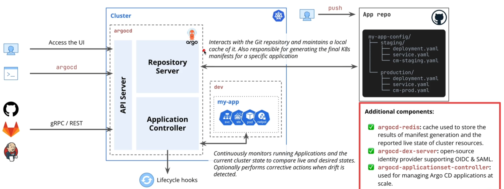
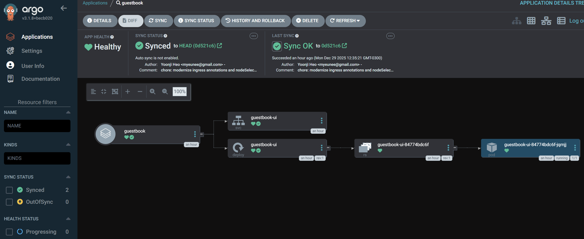
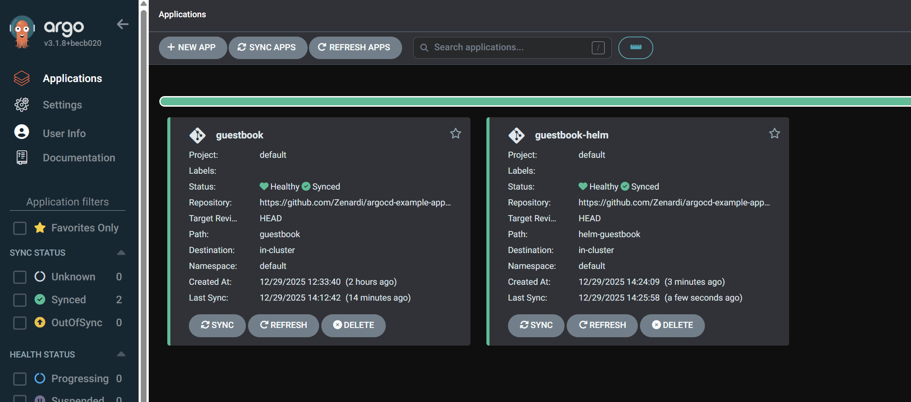
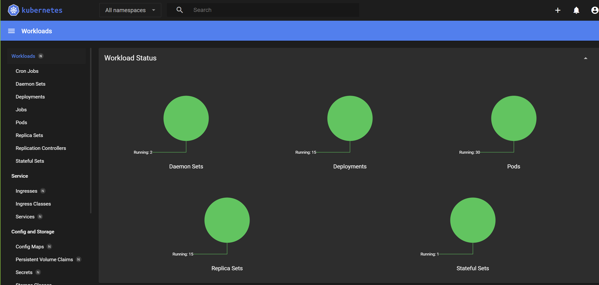
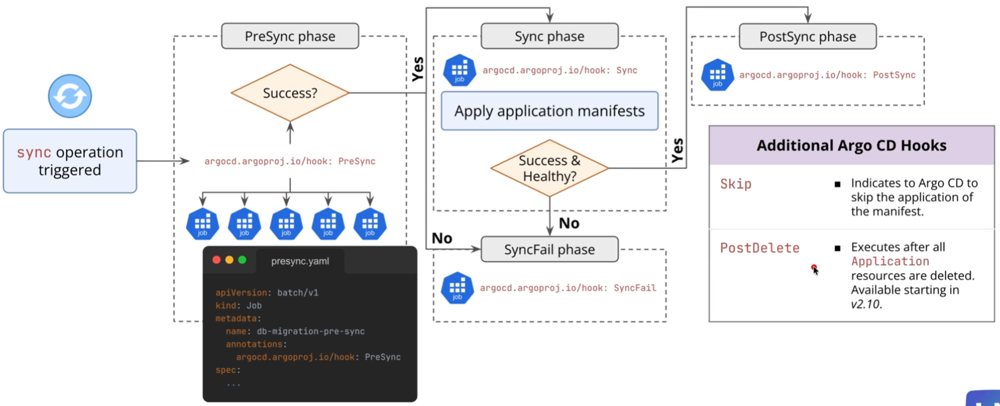
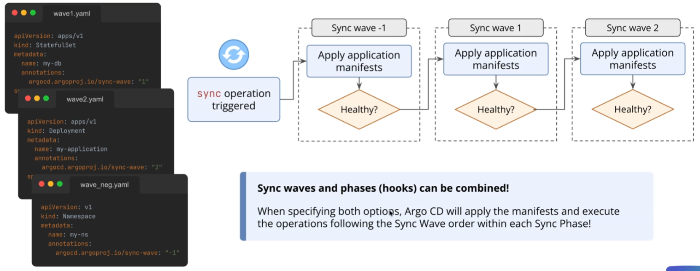

- [Install Argo on K8S Cluster with Helm](#install-argo-on-k8s-cluster-with-helm)
  - [📝 Overview \& Concepts](#-overview--concepts)
  - [📋 Tasks](#-tasks)
- [Access Web UI](#access-web-ui)
  - [📝 Overview \& Concepts](#-overview--concepts-1)
  - [📋 Tasks](#-tasks-1)
- [ArgoCD Components](#argocd-components)
- [Deploying First App](#deploying-first-app)
  - [📝 Overview \& Concepts](#-overview--concepts-2)
  - [📋 Tasks](#-tasks-2)
- [Deploying with Helm Charts](#deploying-with-helm-charts)
  - [🎯 Lab Goal](#-lab-goal)
  - [📝 Overview \& Concepts](#-overview--concepts-3)
  - [📋 Lab Tasks](#-lab-tasks)
- [Deploy Public Available Helm Chart](#deploy-public-available-helm-chart)
  - [🎯 Lab Goal](#-lab-goal-1)
  - [📝 Overview \& Concepts](#-overview--concepts-4)
  - [📋 Lab Tasks](#-lab-tasks-1)
  - [🔍 Key Differences from Git-based Charts](#-key-differences-from-git-based-charts)
    - [Accessing the Dashboard](#accessing-the-dashboard)
- [Customize Helm Chart Deployments](#customize-helm-chart-deployments)
  - [🎯 Lab Goal](#-lab-goal-2)
  - [📝 Overview \& Concepts](#-overview--concepts-5)
    - [Understanding Value Precedence](#understanding-value-precedence)
  - [📋 Lab Tasks](#-lab-tasks-2)
    - [Part 1: Explore the Default Values](#part-1-explore-the-default-values)
    - [Part 2: Override Using `valueFiles`](#part-2-override-using-valuefiles)
    - [Part 3: Override Using `valuesObject`](#part-3-override-using-valuesobject)
    - [Part 4: Override Using `parameters`](#part-4-override-using-parameters)
  - [📚 Helpful Resources](#-helpful-resources)
  - [💡 Best Practices](#-best-practices)
- [Automated Sync Pruning](#automated-sync-pruning)
  - [🎯 Lab Goal](#-lab-goal-3)
  - [📝 Overview \& Concepts](#-overview--concepts-6)
  - [📋 Lab Tasks](#-lab-tasks-3)
  - [📚 Helpful Resources](#-helpful-resources-1)
- [Self-healing capability](#self-healing-capability)
  - [🎯 Lab Goal](#-lab-goal-4)
  - [📝 Overview \& Concepts](#-overview--concepts-7)
  - [📋 Lab Tasks](#-lab-tasks-4)
  - [📚 Helpful Resources](#-helpful-resources-2)
  - [💭 Reflection Questions](#-reflection-questions)
- [Connect to Private Repos Using HTTPS](#connect-to-private-repos-using-https)
  - [🎯 Lab Goal](#-lab-goal-5)
  - [📝 Overview \& Concepts](#-overview--concepts-8)
  - [📋 Lab Tasks](#-lab-tasks-5)
  - [🔍 Key Concepts](#-key-concepts)
  - [📚 Helpful Resources](#-helpful-resources-3)
- [Connect to Private Repos Using SSH](#connect-to-private-repos-using-ssh)
  - [🎯 Lab Goal](#-lab-goal-6)
  - [📝 Overview \& Concepts](#-overview--concepts-9)
  - [📋 Lab Tasks](#-lab-tasks-6)
  - [📚 Helpful Resources](#-helpful-resources-4)
- [ArgoCD Projects](#argocd-projects)
  - [🎯 Lab Goal](#-lab-goal-7)
  - [📝 Overview \& Concepts](#-overview--concepts-10)
  - [📋 Lab Tasks](#-lab-tasks-7)
  - [📚 Helpful Resources](#-helpful-resources-5)
- [Sync Phases and Hooks](#sync-phases-and-hooks)
  - [🎯 Lab Goal](#-lab-goal-8)
  - [📝 Overview \& Concepts](#-overview--concepts-11)
  - [📋 Lab Tasks](#-lab-tasks-8)
  - [📚 Helpful Resources](#-helpful-resources-6)
- [Sync Waves](#sync-waves)
  - [🎯 Lab Goal](#-lab-goal-9)
  - [📝 Overview \& Concepts](#-overview--concepts-12)
  - [📋 Lab Tasks](#-lab-tasks-9)
  - [📚 Helpful Resources](#-helpful-resources-7)
- [📚 Helpful Resources](#-helpful-resources-8)


# Install Argo on K8S Cluster with Helm

Install the Argo CD controller and its components into the cluster using the official Helm chart, ensuring a specific, repeatable version is deployed.

## 📝 Overview & Concepts

We will use Helm, the standard Kubernetes package manager, to install Argo CD. This is the official and recommended method as it correctly handles all of Argo CD's various Kubernetes components. The process involves adding the official Argo Project Helm repository, creating a dedicated `argocd` namespace for organizational hygiene, and then using a `helm install` command with a pinned version to deploy the chart.

## 📋 Tasks

1.  Add the official Argo Project Helm repository to your local Helm client.
2.  Update your Helm repositories to ensure you have the latest chart information.
3.  Create a dedicated `argocd` namespace in your cluster.
4.  Install the `argo-cd` Helm chart version `8.6.0` into the `argocd` namespace.
5.  Verify that all the Argo CD pods have been created and are in a `Running` state.

```shell
kubectl apply -f argocd/argons.yaml # to create argocd namespace 
# OR 
kubectl create ns  argocd

helm repo add argo https://argoproj.github.io/argo-helm
helm repo update
helm search repo argo/argo-cd  --versions

helm upgrade argocd argo/argo-cd --version 8.6.0 --install --create-namespace -n argocd
```


---

# Access Web UI

Access the Argo CD web UI and install the command-line interface (CLI) to gain full control over your Argo CD installation.

## 📝 Overview & Concepts

Argo CD is now running in our cluster, but by default, it's not exposed to the outside world. To interact with it, we need to connect securely. In this lab, we'll first retrieve the auto-generated initial admin password from a Kubernetes secret. Then, we'll use `kubectl port-forward` to create a secure tunnel from our local machine to the Argo CD server pod. This will allow us to log in via a web browser. Finally, we'll install the powerful `argocd` CLI for command-line operations and log in with it as well.

## 📋 Tasks

1.  Retrieve the initial admin password for the `admin` user from the `argocd-initial-admin-secret` Kubernetes secret and decode it.
2.  Use `kubectl port-forward` to make the Argo CD server UI accessible on `localhost:8080`.
3.  Log in to the Argo CD web UI in your browser using the `admin` username and the retrieved password.
4.  Install the `argocd` CLI tool on your local machine.
5.  Log in to the Argo CD API server using the `argocd` CLI.

```shell
kubectl get svc -n argocd
# NAME                               TYPE        CLUSTER-IP      EXTERNAL-IP   PORT(S)             AGE
# argocd-applicationset-controller   ClusterIP   10.96.8.127     <none>        7000/TCP            5m14s
# argocd-dex-server                  ClusterIP   10.96.241.140   <none>        5556/TCP,5557/TCP   5m14s
# argocd-redis                       ClusterIP   10.96.243.30    <none>        6379/TCP            5m14s
# argocd-repo-server                 ClusterIP   10.96.83.32     <none>        8081/TCP            5m14s
# argocd-server                      ClusterIP   10.96.63.202    <none>        80/TCP,443/TCP      5m14s

kubectl port-forward svc/argocd-server -n argocd 8080:80

# To get the admin password
kubectl get secret -n argocd
# NAME                           TYPE                 DATA   AGE
# argocd-initial-admin-secret    Opaque               1      8m36s
# argocd-notifications-secret    Opaque               0      8m37s
# argocd-redis                   Opaque               1      8m41s
# argocd-secret                  Opaque               5      8m37s
# sh.helm.release.v1.argocd.v1   helm.sh/release.v1   1      8m43s

kubectl get secret argocd-initial-admin-secret -o jsonpath="{.data.password}" -n argocd | base64 --decode

# Install argocd cli
curl -sSL -o argocd-linux-amd64 https://github.com/argoproj/argo-cd/releases/latest/download/argocd-linux-amd64
sudo install -m 555 argocd-linux-amd64 /usr/local/bin/argocd
rm argocd-linux-amd64
```

---
# ArgoCD Components



---

# Deploying First App

Define and deploy your first GitOps-managed application using the core Argo CD resource: the `Application` CRD.

## 📝 Overview & Concepts

The heart of Argo CD is a Custom Resource Definition (CRD) called `Application`. This resource is a declarative manifest that acts as a contract, telling Argo CD three main things: **where** the desired state is defined (a Git repository), **what** to deploy (a specific path and version in that repo), and **where** to deploy it (a destination cluster and namespace).

In this lab, you will write an `Application` manifest from scratch. You will commit this file to your Git repository. Then, you will perform a one-time `kubectl apply` of this manifest to "bootstrap" the application and register it with Argo CD. From that moment on, Argo CD will take over, pulling the manifests from the source repository and deploying them to the destination namespace.

## 📋 Tasks

1.  Create a new YAML file for your `Application` resource.
2.  Define the `metadata` for the `Application`, giving it the name `guestbook` and ensuring it lives in the `argocd` namespace.
3.  Define the `spec.project` as `default` and the `spec.source` to point to a public Git repository containing plain Kubernetes manifests. You can use the following for a demo application:
    - **Repo URL:** `https://github.com/lm-academy/argocd-example-apps.git`
    - **Revision:** `HEAD`
    - **Path:** `guestbook`
4.  Define the `spec.destination` field to deploy the application to the local cluster (`https://kubernetes.default.svc`) into the `default` namespace.
5.  Apply the `Application` manifest to your cluster using `kubectl apply`.
6.  Verify in the Argo CD UI that the `guestbook` application appears and successfully syncs.
7.  Use `kubectl` to verify that the `guestbook` application's resources (Deployments, Services) are running in the `default` namespace.

```shell
kubectl apply -f guestbook-app.yaml
```



# Deploying with Helm Charts

## 🎯 Lab Goal

Refactor an existing Argo CD `Application` to deploy the same application, but this time from a Helm chart located within our Git repository.

## 📝 Overview & Concepts

Deploying applications from plain YAML is great, but many real-world applications are packaged as Helm charts to manage complexity and templating. In this lab, you'll learn how to adapt an Argo CD `Application` manifest to deploy from a Helm chart instead of a directory of raw manifests.

We will be using a pre-made Helm chart for our `guestbook` application, which is already located in our examples repository. You will modify your existing `guestbook-app.yaml` manifest, changing the `spec.source` to point to this Helm chart, and observe as Argo CD seamlessly transitions the live application to be managed by the chart.

## 📋 Lab Tasks

1.  Explore the `helm-guestbook` directory in your `argocd-example-apps` repository to familiarize yourself with the simple Helm chart structure.
2.  Open your `guestbook-app.yaml` manifest for editing.
3.  Modify the `spec.source` section of the manifest:
    - Change the `repoURL` to point to your own fork of `lm-academy/argocd-example-apps` repository.
    - Set the `path` to `helm-guestbook`.
    - Add a new `helm` block.
    - Inside the `helm` block, add a `valueFiles` entry pointing to the chart's default `values.yaml` file.
4.  Apply the updated manifest to the cluster.
5.  Open the Argo CD UI and wait for the application to be considered `OutOfSync`.
6.  Trigger a `Sync` operation and observe in the Argo CD UI as the application syncs. Notice that although the source has fundamentally changed, the deployed resources remain the same, demonstrating Argo CD's powerful diffing capabilities.
7.  Verify with `kubectl` that the `guestbook` pods are still running correctly.

```yaml
apiVersion: argoproj.io/v1alpha1
kind: Application
metadata:
  name: guestbook-helm
  namespace: argocd
spec:
  project: default
  source:
    repoURL: https://github.com/Zenardi/argocd-example-apps.git
    targetRevision: HEAD
    path: helm-guestbook
    helm:
      valueFiles:
        - values.yaml
  destination:
    server: https://kubernetes.default.svc
    namespace: default
```



# Deploy Public Available Helm Chart

## 🎯 Lab Goal

Deploy an application to your cluster using Argo CD from a publicly available Helm chart repository, specifically the Kubernetes Dashboard.

## 📝 Overview & Concepts

While Git repositories containing Helm charts are common, many applications are distributed through public Helm chart repositories. Argo CD can seamlessly deploy applications from these public repositories, such as Bitnami charts, official Kubernetes charts, and many others.

In this lab, you'll learn how to configure an Argo CD `Application` to deploy from a public Helm repository. Instead of pointing to a Git repository with a `path` to a chart directory, you'll use the `chart` field to reference a chart by name and specify the chart repository URL.

We will deploy the Kubernetes Dashboard, a web-based UI for Kubernetes cluster management, which is hosted in the official Kubernetes Helm chart repository.

## 📋 Lab Tasks

1.  Create a new namespace named `k8s-dashboard`.
2.  Create a new Argo CD `Application` manifest file named `k8s-dashboard-app.yaml`.
3.  Configure the `spec.source` section to deploy from a public Helm repository:
    - Set the `repoURL` to `https://kubernetes.github.io/dashboard/` (the Kubernetes Dashboard Helm repository).
    - Instead of using `path`, use the `chart` field and set it to `kubernetes-dashboard`.
    - Set `targetRevision` to `7.13.0` to pin to a specific chart version.
4.  Configure the `spec.destination` section:
    - Set `server` to `https://kubernetes.default.svc` (the in-cluster API server).
    - Set `namespace` to `k8s-dashboard` (or your preferred namespace).
5.  Apply the manifest to create the Argo CD Application.
6.  Open the Argo CD UI and observe the application being synced.
7.  Once synced, verify the Kubernetes Dashboard pods are running using `kubectl`.
8.  (Optional) Access the Kubernetes Dashboard by port-forwarding to the service and exploring the UI.

```shell
kubectl create ns k8s-dashboard

```

## 🔍 Key Differences from Git-based Charts

When deploying from a public Helm repository instead of a Git repository:

- **`repoURL`**: Points to the Helm chart repository URL (not a Git repository)
- **`chart`**: Specifies the chart name (replaces the `path` field used for Git repos)
- **`targetRevision`**: Refers to the chart version (not a Git commit/branch/tag)


### Accessing the Dashboard

Port-forward to access the dashboard locally:

```bash
kubectl port-forward svc/k8s-dashboard-kong-proxy 8443:443 -n k8s-dashboard
```

Then access the dashboard at: `https://localhost:8443`

**Note:** You'll need to create a service account and token to log in:

```bash
# Create a service account
kubectl create serviceaccount k8s-dashboard-admin -n k8s-dashboard

# Create a cluster role binding
kubectl create clusterrolebinding k8s-dashboard-admin \
  --clusterrole=cluster-admin \
  --serviceaccount=k8s-dashboard:k8s-dashboard-admin

# Get the token
kubectl create token k8s-dashboard-admin -n k8s-dashboard
```

Use the generated token to log in to the dashboard.



# Customize Helm Chart Deployments
## 🎯 Lab Goal

Learn how to customize Helm chart deployments in Argo CD by setting custom values using different override methods, and understand the order of precedence when values conflict.

## 📝 Overview & Concepts

One of the most powerful features of Helm charts is their ability to be configured through values. When deploying charts with Argo CD, you need to know how to override these default values to customize your deployments for different environments and use cases.

Argo CD provides three main methods to override Helm chart values within the `spec.source.helm` block:

1. **`valueFiles`**: Reference one or more values files from your Git repository
2. **`valuesObject`**: Define value overrides directly in the Application manifest as structured YAML
3. **`parameters`**: Override individual values using key-value pairs

### Understanding Value Precedence

When the same value is defined in multiple places, Argo CD follows a strict order of precedence (from lowest to highest priority):

1. `values.yaml` in the chart itself (the defaults)
2. `valueFiles`
3. `valuesObject` / `values`
4. `parameters` (highest priority)

This means that `parameters` will always win over `valuesObject`, which wins over `valueFiles`, which wins over the chart's default `values.yaml`.

## 📋 Lab Tasks

### Part 1: Explore the Default Values

1. Navigate to your fork of the `argocd-example-apps` repository
2. Open the `helm-guestbook/values.yaml` file to see the default chart values
3. Note the default `replicaCount` value

### Part 2: Override Using `valueFiles`

1. In your `argocd-example-apps` repository, create a new file called `values-custom.yaml` in the `helm-guestbook` directory
2. In this file, set:
   - `replicaCount: 3`
3. Commit and push this file to your repository
4. Update your `guestbook-app.yaml` Application manifest to use this values file:
   ```yaml
   helm:
     valueFiles:
       - values-production.yaml
   ```
5. Apply the updated manifest and sync the application in Argo CD UI
6. Verify with `kubectl` that 3 replicas are now running

### Part 3: Override Using `valuesObject`

1. Update your `guestbook-app.yaml` to replace the `valueFiles` with `valuesObject`:
   ```yaml
   helm:
     valuesObject:
       replicaCount: 2
       service:
         type: NodePort
   ```
2. Apply the manifest and sync in Argo CD
3. Verify that now only 2 replicas are running and the service type changed to NodePort
4. Notice how `valuesObject` completely replaced the previous configuration

### Part 4: Override Using `parameters`

1. Update your `guestbook-app.yaml` to add `parameters` while keeping `valuesObject`:
   ```yaml
   helm:
     valuesObject:
       replicaCount: 2
       service:
         type: NodePort
     parameters:
       - name: replicaCount
         value: '1'
   ```
2. Apply the manifest and sync
3. Verify that only 1 replica is running now
4. Observe that the `parameters` value (1) overrode the `valuesObject` value (2)

## 📚 Helpful Resources

- [Argo CD - Helm Values Documentation](https://argo-cd.readthedocs.io/en/stable/user-guide/helm/#values-files)
- [Helm Values Documentation](https://helm.sh/docs/chart_template_guide/values_files/)
- [Argo CD Application Specification](https://argo-cd.readthedocs.io/en/stable/operator-manual/declarative-setup/#applications)

## 💡 Best Practices

- **Use `valueFiles`** for environment-specific configurations (dev, staging, prod)
- **Use `valuesObject`** for structured overrides that should be visible in the Application manifest
- **Use `parameters`** sparingly, typically for single values that need to override everything else
- Remember the precedence order when troubleshooting unexpected values


# Automated Sync Pruning
## 🎯 Lab Goal

Configure an Argo CD application to sync automatically when a change is detected in Git and to prune resources that are no longer defined in the source of truth.

## 📝 Overview & Concepts

A truly automated GitOps workflow doesn't require manual intervention. In this lab, you will enable two crucial sync policies on your `guestbook` application: `automated` and `prune`. The `automated` policy will tell Argo CD to automatically apply changes from Git without you needing to click "Sync". The `prune` policy will ensure that if you delete a manifest from your Git repository, Argo CD will automatically delete the corresponding resource from the cluster.

You will test this by first adding a new `ConfigMap` to your Helm chart and watching it get deployed automatically. Then, you will delete the `ConfigMap` manifest from the chart and observe as Argo CD prunes it from the cluster, keeping your environment perfectly in sync with Git.

## 📋 Lab Tasks

1.  Add a `syncPolicy` block to your `guestbook-app.yaml` manifest.
2.  Inside the `syncPolicy`, set `automated` to an empty object `{}`.
3.  Apply the updated manifest to the cluster to update the application's settings.
4.  In your Helm chart, add a new manifest for a simple `ConfigMap`.
5.  Commit and push this change to your Git repository.
6.  Observe in the Argo CD UI as the change is automatically detected and synced without any manual clicks.
7.  Verify with `kubectl` that the new `ConfigMap` exists.
8.  Now, delete the `ConfigMap` manifest file from your Helm chart.
9.  Commit and push this deletion.
10. Observe in the Argo CD UI as the resource gets marked as non-existent, but is not immediately deleted.
11. Enable pruning by changing the `automated` option from an empty object to `prune: true`.
12. Apply the updated manifest to the cluster to update the application's settings.
13. Observe in the Argo CD UI as the `prune` policy takes effect, automatically deleting the `ConfigMap` from the cluster.
14. Verify with `kubectl` that the `ConfigMap` is gone.

## 📚 Helpful Resources

- [Argo CD - Automated Sync Policy](https://argo-cd.readthedocs.io/en/stable/user-guide/auto_sync/)
- [Kubernetes ConfigMaps Documentation](https://kubernetes.io/docs/concepts/configuration/configmap/)


# Self-healing capability
## 🎯 Lab Goal

Enable and observe Argo CD's self-healing capability to **automatically revert configuration drift** and enforce Git as the absolute source of truth.

## 📝 Overview & Concepts

Self-healing is the ultimate enforcement mechanism in a GitOps workflow. While automated sync reacts to changes in Git, self-heal reacts to changes made directly in the cluster, correcting any drift from the desired state.

In this lab, you will enable the `selfHeal` policy on your `guestbook` application. Then, you will manually change a resource in the cluster using `kubectl`. You will then observe as Argo CD's self-heal policy immediately detects this deviation and automatically reverts your change, ensuring the cluster's live state always matches what is declared in Git.

## 📋 Lab Tasks

1.  Add the `selfHeal: true` option to the `syncPolicy` block of your `guestbook-app.yaml` manifest.
2.  Apply the updated manifest to the cluster.
3.  Use the `kubectl scale` command to manually change the number of replicas for the `guestbook` deployment to a different value (e.g., `1`).
4.  Observe in the Argo CD UI as the application becomes `OutOfSync` and is almost instantly and automatically synced back to the state defined in Git.
5.  Verify with `kubectl` that the number of replicas has been restored to the value specified in your `Application` manifest's `valuesObject`.

## 📚 Helpful Resources

- [Argo CD - Automated Sync Policy (includes Self-Heal)](https://argo-cd.readthedocs.io/en/stable/user-guide/auto_sync/)
- [Kubectl `scale` Command Documentation](https://kubernetes.io/docs/reference/generated/kubectl/kubectl-commands#scale)

## 💭 Reflection Questions

1. Why does automated sync alone not fix configuration drift (manual cluster changes), and how does self-healing complete the GitOps enforcement loop?
2. What are the potential risks of enabling pruning in a shared namespace where multiple teams deploy applications, and how would you mitigate these risks?
3. Under what circumstances might you want to temporarily disable self-healing in production, and what are the trade-offs of doing so?

# Connect to Private Repos Using HTTPS
## 🎯 Lab Goal

Connect Argo CD to a private Git repository using HTTPS authentication with a username and Personal Access Token (PAT).

## 📝 Overview & Concepts

In production environments, your GitOps repositories will almost always be private. Argo CD needs credentials to access these repositories. The simplest authentication method is using HTTPS with a username and Personal Access Token (PAT).

A Personal Access Token is like a password, but it's designed for applications rather than humans. It can be scoped with specific permissions (like read-only access to repositories) and can be easily revoked if compromised. This makes PATs much safer than using your actual password.

In this lab, you'll create a private repository, generate a PAT from your Git provider, and configure Argo CD to authenticate using these credentials.

## 📋 Lab Tasks

1.  Create a new **private** repository on your Git provider (GitHub, GitLab, etc.)
2.  Clone the private repository to your local machine
3.  Copy the `helm-guestbook` chart from your `argocd-example-apps` fork into the new private repository
4.  Commit and push the chart to your private repository
5.  Generate a Personal Access Token (PAT) from your Git provider with appropriate permissions:
    - The token needs read access to repositories
    - Set an appropriate expiration date
    - **Save the token immediately** - you won't be able to see it again
6.  In the Argo CD UI, navigate to Settings → Repositories
7.  Connect a new repository using:
    - Connection method: HTTPS
    - Repository URL: The HTTPS URL of your private repository
    - Username: Your Git provider username
    - Password: Your Personal Access Token
8.  Test the connection to ensure Argo CD can access the repository
9.  Create a new Application manifest (e.g., `guestbook-private.yaml`) that references your private repository
10. Apply the manifest and verify the application syncs successfully from the private repository

## 🔍 Key Concepts

**Why use a PAT instead of a password?**

- PATs can be scoped with minimal permissions (principle of least privilege)
- PATs can be revoked individually without changing your password
- PATs can have expiration dates for automatic rotation
- Many Git providers now require PATs for API access

**Security Best Practices:**

- Use read-only tokens when possible
- Set reasonable expiration dates
- Store tokens securely (never commit them to Git!)
- Rotate tokens periodically
- Revoke tokens when they're no longer needed

## 📚 Helpful Resources

- [Argo CD - Private Repositories Documentation](https://argo-cd.readthedocs.io/en/stable/user-guide/private-repositories/)
- [GitHub - Creating a Personal Access Token](https://docs.github.com/en/authentication/keeping-your-account-and-data-secure/creating-a-personal-access-token)

# Connect to Private Repos Using SSH

## 🎯 Lab Goal

Connect Argo CD to a private Git repository using SSH authentication with deploy keys, implementing a production-grade security pattern.

## 📝 Overview & Concepts

While username/PAT authentication works well, SSH deploy keys represent the gold standard for production GitOps workflows. A deploy key is a dedicated SSH key pair that grants access to a single repository, typically with read-only permissions.

The advantages of deploy keys over PATs include:

- **Repository-specific**: Each key only grants access to one repository
- **No user account dependency**: Keys aren't tied to an individual's account
- **Read-only by default**: Most Git providers enforce read-only access for deploy keys
- **Auditable**: Deploy key usage is logged separately from user activity
- **Long-lived**: No expiration dates to manage

In this lab, you'll generate an SSH key pair specifically for Argo CD, configure your repository to accept this key, and update your application to use SSH authentication.

## 📋 Lab Tasks

1.  Create a new **private** repository on your Git provider (or use the one from the previous lab)
2.  If not already done, copy the `helm-guestbook` chart into this repository and push it
3.  Generate a new SSH key pair on your local machine:
    - Use a descriptive name (e.g., `argocd-deploy-key`)
    - **Do not use a passphrase** (Argo CD can't handle passphrase-protected keys)
4.  Add the **public key** to your repository as a Deploy Key:
    - Navigate to your repository's settings
    - Find the Deploy Keys section
    - Add the public key with an appropriate title
    - Ensure it's set to **read-only** access
5.  In the Argo CD UI, add a new repository connection:
    - Connection method: SSH
    - Repository URL: The SSH URL of your private repository (starts with `git@`)
    - SSH private key: Paste the contents of your **private key** file
6.  Test the connection to verify Argo CD can authenticate
7.  Update your Application manifest to use the SSH repository URL
8.  Apply the manifest and confirm the application syncs from the private repository

## 📚 Helpful Resources

- [Argo CD - Private Repositories Documentation](https://argo-cd.readthedocs.io/en/stable/user-guide/private-repositories/)
- [GitHub - Managing Deploy Keys](https://docs.github.com/en/developers/overview/managing-deploy-keys)
- [SSH Key Generation Guide](https://docs.github.com/en/authentication/connecting-to-github-with-ssh/generating-a-new-ssh-key-and-adding-it-to-the-ssh-agent)

# ArgoCD Projects

## 🎯 Lab Goal

Create a custom Argo CD Project with security guardrails and migrate an existing application into it.

## 📝 Overview & Concepts

To scale Argo CD safely, we must move away from the unrestricted `default` project. In this lab, you will define a new `AppProject` Custom Resource. This project, named `team-finance`, will enforce two critical security policies: it will only allow deploying applications from a specific, whitelisted Git repository, and it will only allow deployments into a specific, whitelisted namespace.

After creating the project, you will deploy your `guestbook` application and make it belong to `team-finance`, demonstrating how to associate applications with your new, more secure configuration.

## 📋 Lab Tasks

1.  Create a new YAML manifest file for your `AppProject` resource named `team-finance-project.yaml`.
2.  In the manifest, define an `AppProject` named `team-finance`.
3.  Configure the project's `spec` to enforce guardrails:
    - Whitelist your private Helm chart repository (`argocd-example-apps-labs`) as the only allowed `sourceRepos`.
    - Whitelist the `guestbook` namespace as the only allowed `destinations`.
4.  Apply the `AppProject` manifest to your cluster to register it with Argo CD.
5.  Modify your `guestbook-app.yaml` manifest, changing the `spec.project` from `default` to `team-finance`.
6.  Apply the updated application manifest.
7.  Verify in the Argo CD UI that the `guestbook` application now belongs to the `team-finance` project.
8.  (Bonus) Test the project's restrictions by temporarily changing the application's destination namespace to a disallowed one and observing the error.

## 📚 Helpful Resources

- [Argo CD Projects Documentation](https://argo-cd.readthedocs.io/en/stable/user-guide/projects/)
- [The `AppProject` CRD Specification](https://argo-cd.readthedocs.io/en/stable/operator-manual/api-docs/#argoproj.io/v1alpha1.AppProject)

# Sync Phases and Hooks
## 🎯 Lab Goal

Configure and deploy a `PreSync` hook using a Kubernetes `Job` to run a task _before_ the main application deployment begins.

## 📝 Overview & Concepts

Many applications require setup tasks, like database migrations, to run before the application itself is deployed. In this lab, you'll implement this pattern using an Argo CD `PreSync` hook. You will create a standard Kubernetes `Job` manifest within your Helm chart's `templates` directory. This `Job` will simulate a database migration by printing a message and pausing for a few seconds. By adding specific Argo CD annotations to this `Job`, you will instruct Argo CD to run it to completion during the `PreSync` phase, before it attempts to sync the main `Deployment` and `Service`.



## 📋 Lab Tasks

1.  In your repository fork, create a new manifest file under the `helm-guestbook` folder named `templates/presync-job.yaml`.
2.  Define a standard Kubernetes `Job` resource in this new file.
3.  The `Job`'s container should use a simple `busybox` image. Its command should print a message like "Running database migrations...", sleep for 10 seconds, and then exit successfully.
4.  Add the `argocd.argoproj.io/hook: PreSync` annotation to the `Job`'s metadata to assign it to the PreSync phase.
5.  Add the `argocd.argoproj.io/hook-delete-policy: BeforeHookCreation,HookSucceeded` annotation to ensure the job is cleaned up after success and can be re-run on subsequent syncs.
6.  Commit and push the new `presync-job.yaml` manifest to your Git repository.
7.  In the Argo CD UI, manually trigger a `Sync` of your `guestbook` application.
8.  Observe the application's sync status and resource tree. Notice how the `Job` resource appears and runs first, and only after it succeeds do the `Deployment` and other resources sync.

## 📚 Helpful Resources

- [Argo CD - Resource Hooks](https://argo-cd.readthedocs.io/en/stable/user-guide/resource_hooks/)
- [Kubernetes `Job` Documentation](https://kubernetes.io/docs/concepts/workloads/controllers/job/)
- [Kubernetes Annotations](https://kubernetes.io/docs/concepts/overview/working-with-objects/annotations/)

# Sync Waves
## 🎯 Lab Goal

Use `sync-wave` annotations to enforce a specific deployment order, ensuring dependent resources are created and healthy before the main application starts.



## 📝 Overview & Concepts

In this lab, you will orchestrate a multi-step deployment using Sync Waves. To clearly visualize the delay between waves, we will create a chain of dependencies:

1.  **Wave 1**: A `ConfigMap` representing a database configuration.
2.  **Wave 2**: A `Job` that simulates a database connectivity check. It will read the configuration and sleep for a few seconds.
3.  **Wave 3**: The main application `Deployment`, which should only start after the check passes.

When you sync the application, you will observe Argo CD pausing between each wave, waiting for the resources in the current wave to become "Healthy" before proceeding to the next.

## 📋 Lab Tasks

1.  In your repository fork, under the `helm-guestbook` folder, create a new manifest file named `templates/database-config.yaml`.
2.  Define a `ConfigMap` named `db-config` with some dummy data (for example, `host: "postgres"`).
3.  Add the annotation `argocd.argoproj.io/sync-wave: "1"` to the `ConfigMap`.
4.  Create another file named `templates/db-check-job.yaml`.
5.  Define a Kubernetes `Job` that reads the `ConfigMap` via an environment variable and runs a command to print the data and sleep for 5 seconds.
6.  Add the annotation `argocd.argoproj.io/sync-wave: "2"` to the `Job`.
7.  Open the existing `templates/deployment.yaml` file.
8.  Add the annotation `argocd.argoproj.io/sync-wave: "3"` to the `Deployment`.
9.  Commit and push all changes to your Git repository.
10. In the Argo CD UI, trigger a `SYNC` of your `guestbook` application.
11. Carefully observe the sync process. Note how the UI updates in stages: ConfigMap -> Job (Running -> Completed) -> Deployment.

## 📚 Helpful Resources

- [Argo CD - Sync Waves Documentation](https://argo-cd.readthedocs.io/en/stable/user-guide/sync-waves/)
- [Kubernetes Annotations](https://kubernetes.io/docs/concepts/overview/working-with-objects/annotations/)
- [Kubernetes ConfigMaps](https://kubernetes.io/docs/concepts/configuration/configmap/)

---
---

# 📚 Helpful Resources
- [Argo CD - Getting Started Guide](https://argo-cd.readthedocs.io/en/stable/getting_started/)
- [Helm `install` Command Documentation](https://helm.sh/docs/helm/helm_install/)
- [Helm `repo` Command Documentation](https://helm.sh/docs/helm/helm_repo/)
- [Kubectl `create namespace` Command Documentation](https://kubernetes.io/docs/reference/generated/kubectl/kubectl-commands#create-namespace)
- [Argo CD Docs - Log In To The UI / CLI](https://argo-cd.readthedocs.io/en/stable/getting_started/#4-login-using-the-cli)
- [Argo CD CLI Installation Guide](https://argo-cd.readthedocs.io/en/stable/cli_installation/)
- [Kubectl `port-forward` Command Documentation](https://kubernetes.io/docs/reference/generated/kubectl/kubectl-commands#port-forward)
- [Argo CD Application CRD Specification](https://argo-cd.readthedocs.io/en/stable/operator-manual/api-docs/#argoproj.io/v1alpha1.Application)
- [Declarative Setup in Argo CD](https://argo-cd.readthedocs.io/en/stable/operator-manual/declarative-setup/)
- [The `argocd-example-apps` Repository](https://github.com/argoproj/argocd-example-apps)
- [My Fork of the `argocd-example-apps` Repository](https://github.com/lm-academy/argocd-example-apps)
- [Argo CD - Helm Chart Documentation](https://argo-cd.readthedocs.io/en/stable/user-guide/helm/)
- [Helm `valueFiles` Documentation](https://argo-cd.readthedocs.io/en/stable/user-guide/helm/#values-files)
- [Argo CD - Helm Chart Documentation](https://argo-cd.readthedocs.io/en/stable/user-guide/helm/)
- [Kubernetes Dashboard Helm Chart](https://artifacthub.io/packages/helm/k8s-dashboard/kubernetes-dashboard)
- [Argo CD Application Specification](https://argo-cd.readthedocs.io/en/stable/operator-manual/application.yaml)
